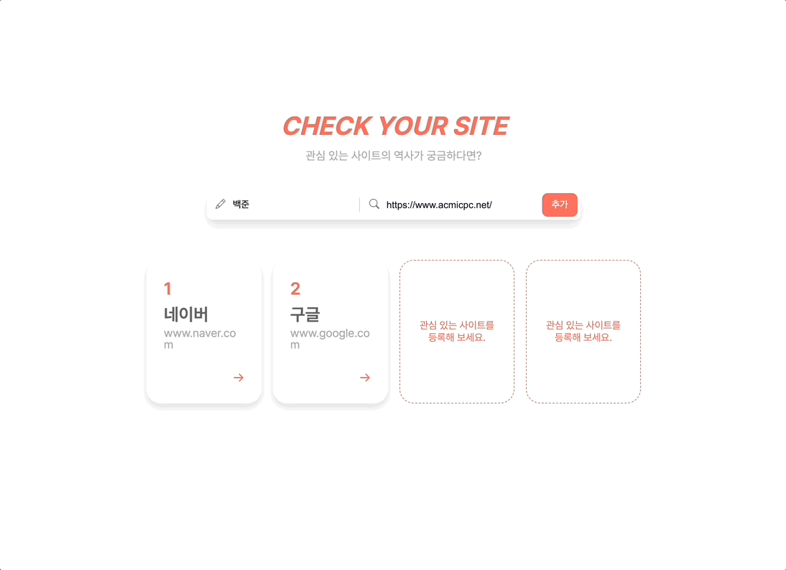
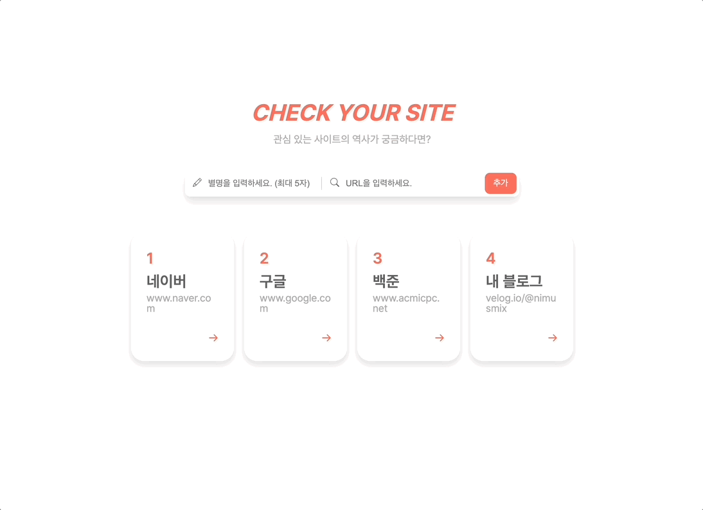

# CHECK YOUR SITE

10년 간의 홈페이지 변화를 확인할 수 있는 사이트

<br/>

### 🚀 서비스 링크

https://check-your-site.netlify.app/

<br/>

### 🖥️ 주요 기능



**관심 사이트 목록**

- 원하는 사이트를 관심 사이트 목록에 등록할 수 있습니다.
- 최대 4개까지 등록이 가능하고, 초과 시 경고 토스트가 나타나며 등록되지 않습니다.
- 등록된 카드를 hovering하면 상세 페이지 이동 버튼과 카드 삭제 버튼을 보여줍니다.
- 카드가 등록되지 않았을 때도 4개의 빈 카드를 보여주어
    사이트를 최대 4개까지 등록할 수 있다는 점을 직관적으로 판단할 수 있게 하였습니다.

<br/>

**관심 사이트 상세**

- 최대 10년 간의 홈페이지가 담긴 카드를 보여줍니다.
- 매년 1월 1일 기준으로 가장 가깝게 저장된 날짜의 홈페이지를 확인할 수 있습니다.
- 카드 좌측 상단에 해당 년도가 나타나며, 년도 우측에는 저장된 홈페이지의 정확한 날짜를 보여줍니다.
- 카드를 클릭하면 해당 년도의 홈페이지를 확인할 수 있는 사이트가 새 창으로 열립니다.
- 저장된 홈페이지가 없을 경우 안내 문구가 나타납니다.

<br/>

### 🔖 추가 기능

**사이트 별명 설정**  [코드](./README.assets/codes.md#사이트-별명-설정)

- 별명을 사용하는 것이 URL을 사용하는 것보다 사용자가 한 눈에 어떤 사이트인지 알아보기 쉬울 것이라고 판단했습니다.
- UI를 고려하여 최대 5자 까지의 별명을 설정할 수 있도록 했습니다.

<br/>

**URL 파싱**  [코드](./README.assets/codes.md#URL-파싱)

- 관심 사이트 카드의 URL은 최대 2줄까지 노출됩니다.
- 따라서 URL에서의 핵심적인 정보만 노출시키기 위해 URL의 프로토콜 이후부터 나타나도록 했습니다.

<br/>

**URL 중복 검사**  [코드](./README.assets/codes.md#URL-중복-검사)

- 데이터가 10년 중 일부만 존재할 경우 가장 가까운 시점이 중복되어 같은 홈페이지가 계속 노출되는 문제가 있었습니다.
- api가 반환하는 timestamp를 이용해 이미 저장된 날짜의 홈페이지라면 다시 저장되지 않도록 했습니다.

<br/>

**URL 목록 캐싱** [코드](./README.assets/codes.md#URL-목록-캐싱)

- 하나의 URL은 해가 넘어가기 전까지 동일한 데이터를 받아옵니다.
- 따라서 계속해서 api 요청을 보내지 않도록 URL을 쿼리 키로 하여 데이터를 캐싱했습니다.
- 다만 해가 바뀌는 시점에 사이트를 이용할 수 있는 점을 고려하여 60분 마다 다시 데이터를 받아오도록 했습니다.

<br/>

### 🧑🏻‍💻 실행 방법

```bash
npm install
npm start
```

<br/>

### 🛠️ 기술 스택

- `TypeScript`, `React`

- `Recoil`

    <details>
      <summary>선정 이유</summary>
      <div>
        본 과제에서는 전역으로 2가지의 상태를 관리합니다.
        (토스트를 띄우기 위한 toastState, 관심 목록을 관리하기 위한 wishlistState)<br/>
        따라서 많은 양의 보일러 플레이트 코드를 작성해야 하는 redux는 비효율적이라고 판단했습니다.<br/>
        또한 useContext는 상태가 변경될 경우 해당 상태를 구독하고 있는 컴포넌트와 그 하위 컴포넌트까지 리렌더링이 발생하므로,<br/>
        불필요한 리렌더링이 많이 발생할 것으로 예상했습니다.<br/>
        따라서 간편하게 상태를 관리할 수 있고, localStorage와의 연동이 쉬운 Recoil을 선정했습니다.
      </div>
    </details>

- `React-query`

    <details>
      <summary>선정 이유</summary>
      <div>
        상세 페이지에서 10년 간의 URL 데이터를 받아올 때 초기 로딩 시간이 길게는 3초 이상 소요됐습니다.<br/>
        데이터가 실시간으로 변동되지 않는다는 점을 고려했을 때 매번 api 요청을 보낼 필요가 없다고 생각했습니다.<br/>
        따라서 캐싱이 쉽고 staleTime을 관리할 수 있는 React-query를 선정했습니다.
      </div>
    </details>

- `React-hook-form`

    <details>
      <summary>선정 이유</summary>
      <div>
        useState를 통해 input과 value를 연동하면 state의 값이 변경될 때마다 컴포넌트가 리렌더링 되는 문제가 있습니다.<br/>
        React-hook-form은 비제어 컴포넌트로 동작하여 렌더링을 최소화할 수 있으며,<br/>
        유효성 검사를 위한 코드도 간단하게 작성할 수 있기 때문에 React-hook-form을 선정했습니다.
      </div>
    </details>

- `Styled-component`

- `Netrify`

<br/>

### ✉️ 마치며

안녕하세요, 먼저 귀한 시간 내시어 과제를 검토해 주셔서 정말 감사드립니다!

기초부터 차근차근 되새겨볼 수 있었던 무척 값진 경험이었습니다. 😄

과제를 수행하면서 '좋은 코드란 무엇일까?' 를 많이 생각했습니다.

제가 생각했을 때 주니어 개발자로서 가장 중요한 좋은 코드의 조건은 '타인이 이해하기 쉬운 코드'가 아닐까 합니다.

과제를 하면서 그 부분을 많이 신경 썼는데, 보시기에 어떨지 매우 궁금하고 떨립니다.

그래서 드리고 싶은 부탁 말씀이 있습니다.

혹시나 시간이 괜찮으시다면, 만약에 전형에서 불합격하더라도 피드백을 받아볼 수 있을까요?

번거로우신 줄 알지만 시간을 할애해 주신다면 앞으로의 저의 성장에 큰 밑거름이 될 수 있을 것 같습니다.

그럼 무더운 여름 건강 조심하세요!

감사합니다.

